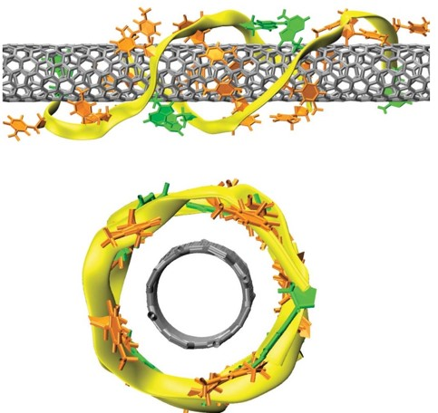

# DNA_CNT

This is the code repository for my final project called **Adsorption of Nucleinotic acids on single-wall carbon nanotubes**.

## Content
- [Background](#background) 
- [Methodology](#methodology)
- [Conclusion](#conclusion)
- [Future Plans](#futureplans)

## Background
Here is what you need to know to understand what problem I solve and how.

### Carbon nanotubes
Carbon nanotubes(CNT) are tubes made from one or more graphene layers. Ideally, a CNT is a cylinder obtained by rolling flat hexagonal graphene grids. Carbon nanotubes have found great applications due to their electronic, thermal, and mechanical properties.

  

These properties are easily described by the geometric parameter of CNTs - chirality. The chirality of nanotubes is denoted by a set of symbols (m, n). It indicates the hexagon coordinates, which, as a result of the folding of the plane, should coincide with the hexagon located at the origin.

  

### Sorting Problem
CNTs have vast applications in the biomedical and hardware development field, where it is essential to have CNTs with given chirality. Unfortunately, modern methods of synthesizing CNTs cant yield structures with identical properties; hence the sorting problem arises.
One of the solutions to this problem is DNA-CNT hybrids, where DNAs work like flags to identify different CNT families. It is possible because of the selectivity of the combination between DNA and CNT. Only certain DNAs "connect" with specific CNTs and vice versa, and the DNA that "connects" with the given CNT is called a recognition sequence.

  

DNA-single-wall carbon nanotube (SWCNT) hybrids have enabled many applications because of their ability to disperse and sort SWCNTs by their chirality and handedness. There is a lot of research about discovering sequences that recognize specific chiralities of SWCNT. Significant progress has been made in understanding underlying structure and thermodynamics of these hybrids. Nevertheless, de novo prediction of recognition sequences remains essentially impossible. The success rate for their discovery by search of the vast single-stranded DNA library is low. Theoretical and Computational methods are very time-consuming and ineffective. That's why it's worth trying to solve the problem using statistics and machine learning.

## Methodology

The data set consists of 972 records, with different combinations of single-stranded DNA with nucleotides C(Cytosine) and T(Thymine) with nanotubes with different chiralities. Recognition sequences have a 'Y' label and the non-recognition sequences have an 'N' label.

I preprocessed string sequences using `CountVectorizer`, `HashingVectorizer`, and `TfidfVectorizer` from package sklearn. I trained two models: Logistic Regression and Support Vector Machine. Overall results were poor and the hyperparameter tuning yielded zero results.

## Conclusion

Logistic Regression and Support Vector Machine couldn't solve the task. That's probably because only 12 records out of 972 were recognition sequences. Only 1.2% of the records have a 'Y' label.

## Future Plans
As it's evident that we are working with rare-event data, it is worth trying to reformulate the problem as an anomaly detection task. To solve it, I will implement an auto encoder. Also, I designed a new method to preprocess the data and it will be implemented too.

### Data Preprocessing

The main point of this preprocessing method is to represent our data as a linear function:
$R(\vec{s}) = m\vec{s} + n$ , where
- m and n are chirality indexes,
- $\vec{s}$ is sequence vector $-$ $\begin{bmatrix} s_{1} \\ s_{2} \\ \vdots \\ s_{n} \end{bmatrix}$.

The sequence vector is represented as a string in the dataset, but it can be converted into an array of ASCII codes. Other way to preprocess the string data can fit here easily. But at first I will use ASCII code representation.
